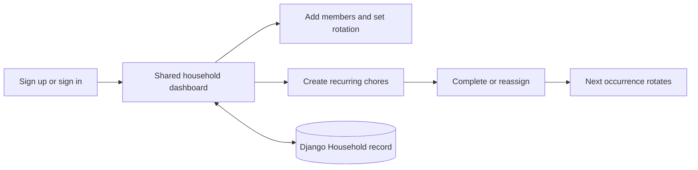

<div align="center">
  
  <h1>share the load</h1>
  <p>A calm, practical way for a household to share recurring chores.</p>
  <p>
    <a href="#quick-start">Quick start</a> ·
    <a href="#testing">Testing</a> ·
    <a href="#how-it-works">How it works</a>
  </p>
  <p>
    
    
    
  </p>
</div>

<p align="center">
  
</p>

## 💡 Why this exists

Household chores are recurring, easy to forget, and often unevenly shared. **share the load** keeps the routine visible: create a household, add the people in rotation order, and let each chore move to the next person when its next occurrence begins.

The interface is designed for quick everyday use. The dashboard keeps the list, rotation controls, completion history, and chore editor together so a household can update its plan without navigating through multiple screens.

## ✨ What you can do

- Create an account and use one shared household login across devices.
- Add daily, weekly, or monthly chores with optional assignees.
- Set and reorder a household rotation.
- Mark chores done, reassign the current occurrence, and keep recent history.
- See overdue work, upcoming assignments, and the next rotation member.
- Use the keyboard and a responsive layout on desktop, tablet, or mobile.

## 🧭 How it works



| Layer | Responsibility |
| --- | --- |
| Django views and authentication | Account creation, sign-in, protected dashboard access, and session handling |
| `Household` model | One database-backed state record per account |
| Browser JavaScript | Scheduling, rotation, validation, accessible interactions, and rendering |
| SQLite locally | Simple development database; the schema is ready to move to hosted Postgres |

Authenticated dashboard data is stored in the Django database. The production dashboard does not use browser `localStorage`, so all household members reading the same account see the same saved state.

## 🚀 Quick start

Requirements: Python 3.12+, [uv](https://docs.astral.sh/uv/), and Node.js 22+ for the JavaScript tests.

```bash
# From the repository root
uv sync --locked
uv run python manage.py migrate
uv run python manage.py runserver
```

Open [http://127.0.0.1:8000/signup/](http://127.0.0.1:8000/signup/) to create an account, or go to [http://127.0.0.1:8000/login/](http://127.0.0.1:8000/login/) if you already have one. The root dashboard is protected; visitors must sign in first.

`uv` creates and manages the project virtual environment. Dependencies are declared in `pyproject.toml` and pinned in `uv.lock`. The default settings are for local development and use SQLite at `db.sqlite3`.

To add a Python dependency during development, use `uv add <package>` so the project files and lockfile stay in sync. The generated Django settings are intentionally local-development settings.

## 🔁 Scheduling rules

- Dates use the browser's local calendar.
- Daily, weekly, and monthly chores calculate their next occurrence from the recurrence rule. A monthly date that does not exist uses that month's last day.
- The first due date is today or the next date that matches the recurrence rule.
- A completed chore stays visible until its next occurrence begins, then rotates to the next member.
- A completed row previews the next member while its stored completion and history still show who completed the current occurrence.
- Overdue work keeps its current assignee. Missed occurrences do not create a backlog of duplicate chores.
- An initially unassigned chore receives the first available member at its next occurrence.
- Manual reassignment affects only the current occurrence; it does not move the rotation cursor.
- History keeps the latest 20 completion records with snapshot names, so later edits do not rewrite past activity.
- Editing a recurrence starts a fresh occurrence. Changing only the chore name or assignee preserves its completion and rotation position.
- Scheduling reconciles when the page loads, returns to the foreground, or crosses into a new local date. Returning after several days leaves one pending occurrence, which may be overdue.

If a household has no members, chores can remain unassigned until someone is added. Completing an unassigned chore opens a member picker so the completion history still records who did the work.

## 🗂️ Project structure

```text
share-the-load/
├── chores/
│   ├── models.py                  # Household database model
│   ├── views.py                   # Auth, dashboard, and state API
│   ├── templates/                 # Dashboard and account screens
│   ├── static/chores/             # CSS, JavaScript, and local illustrations
│   ├── js_tests/                  # Domain and state unit tests
│   └── browser_tests/             # Playwright user-flow tests
├── share_the_load/                # Django project configuration
├── _docs/plan.md                  # Product plan used for the backlog
├── backlog.md                     # Implemented project backlog
├── pyproject.toml                 # Python and Django dependencies
└── package.json                   # Browser test tooling
```

## 🧪 Testing

Run Django checks and Python tests:

```bash
uv run python manage.py check
uv run python manage.py test
```

Run the scheduling, rotation, validation, and state unit tests:

```bash
npm test
TZ=America/New_York node --test chores/js_tests/*.test.mjs
```

Run the responsive end-to-end suite. Install the browser dependencies once:

```bash
npm ci
npx playwright install --with-deps chromium
npm run test:browser
```

The Playwright suite starts its own Django server on `127.0.0.1:8001`; keep that port free. It uses isolated browser contexts, so it does not affect a development server running on port 8000. Browser coverage includes signup and shared sign-in, protected dashboard access, database persistence across sessions, chore CRUD, assignment and rotation, history, date boundaries, keyboard behavior, and mobile/tablet/desktop layouts. Failures save screenshots and traces under the ignored `test-results/` directory.

## 📝 Project notes

- Local development uses SQLite. For deployment, configure a managed Postgres database through environment variables rather than relying on an ephemeral hosting filesystem.
- The browser's local timezone determines displayed dates and recurrence boundaries.
- The development server is intended for local use; set production secrets, hosts, HTTPS, and database settings before deploying.
- The account flow uses Django's built-in authentication. Each account owns one `Household` record, and household members intentionally use the same credentials to access that shared record. The state endpoint is authenticated and CSRF-protected; users cannot read or update another account's household.

## 🤖 Origin

This project was built with **OpenAI Codex** as part of the **AI Dev Tools Zoomcamp 2026**, first homework assignment. The implementation followed the product plan in `_docs/plan.md`, with the backlog documenting the work from the initial Django scaffold through authentication, database persistence, rotation behavior, responsive design, and automated testing.
